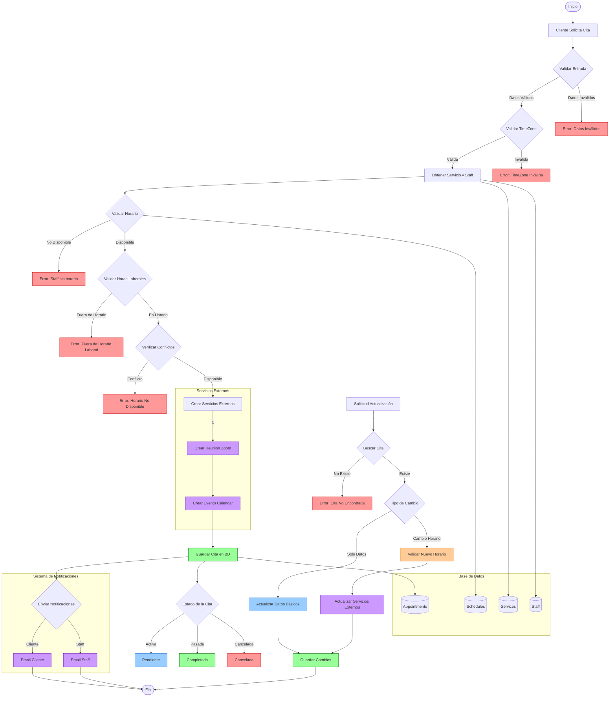

# Diagrama Completo del Sistema de Citas

```mermaid
flowchart TD
    %% Estilos
    classDef error fill:#ff9999,stroke:#cc0000
    classDef success fill:#99ff99,stroke:#006600
    classDef process fill:#99ccff,stroke:#0066cc
    classDef validation fill:#ffcc99,stroke:#ff9933
    classDef external fill:#cc99ff,stroke:#6600cc

    %% Inicio del Proceso
    Start([Inicio]) --> RequestAppointment[Cliente Solicita Cita]
    RequestAppointment --> ValidateInput{Validar Entrada}

    %% Validaciones Iniciales
    ValidateInput -->|Datos Válidos| ValidateTimeZone{Validar TimeZone}
    ValidateInput -->|Datos Inválidos| Error1[Error: Datos Inválidos]:::error

    ValidateTimeZone -->|Válida| GetServices[Obtener Servicio y Staff]
    ValidateTimeZone -->|Inválida| Error2[Error: TimeZone Inválida]:::error

    %% Validación de Horarios y Disponibilidad
    GetServices --> ValidateSchedule{Validar Horario}
    ValidateSchedule -->|No Disponible| Error3[Error: Staff sin horario]:::error
    ValidateSchedule -->|Disponible| ValidateWorkingHours{Validar Horas Laborales}

    ValidateWorkingHours -->|Fuera de Horario| Error4[Error: Fuera de Horario Laboral]:::error
    ValidateWorkingHours -->|En Horario| CheckConflicts{Verificar Conflictos}

    CheckConflicts -->|Conflicto| Error5[Error: Horario No Disponible]:::error
    CheckConflicts -->|Disponible| CreateExternalServices[Crear Servicios Externos]

    %% Servicios Externos
    subgraph ExternalServices [Servicios Externos]
        CreateExternalServices -->|1| CreateZoom[Crear Reunión Zoom]:::external
        CreateZoom --> CreateCalendar[Crear Evento Calendar]:::external
    end

    %% Guardado y Notificaciones
    CreateCalendar --> SaveAppointment[Guardar Cita en BD]:::success
    SaveAppointment --> SendNotifications{Enviar Notificaciones}

    %% Notificaciones
    subgraph Notifications [Sistema de Notificaciones]
        SendNotifications -->|Cliente| NotifyClient[Email Cliente]:::external
        SendNotifications -->|Staff| NotifyStaff[Email Staff]:::external
    end

    %% Actualización de Cita
    RequestUpdate[Solicitud Actualización] --> FindAppointment{Buscar Cita}
    FindAppointment -->|No Existe| Error6[Error: Cita No Encontrada]:::error
    FindAppointment -->|Existe| CheckChanges{Tipo de Cambio}

    CheckChanges -->|Solo Datos| UpdateBasic[Actualizar Datos Básicos]:::process
    CheckChanges -->|Cambio Horario| ValidateNewSchedule[Validar Nuevo Horario]:::validation

    ValidateNewSchedule --> UpdateExternal[Actualizar Servicios Externos]:::external
    UpdateExternal --> SaveChanges[Guardar Cambios]:::success
    UpdateBasic --> SaveChanges

    %% Estados de la Cita
    SaveAppointment --> AppointmentStatus{Estado de la Cita}
    AppointmentStatus -->|Activa| Pending[Pendiente]:::process
    AppointmentStatus -->|Pasada| Completed[Completada]:::success
    AppointmentStatus -->|Cancelada| Cancelled[Cancelada]:::error

    %% Conexiones con Base de Datos
    subgraph Database [Base de Datos]
        AppointmentDB[(Appointments)]
        ScheduleDB[(Schedules)]
        StaffDB[(Staff)]
        ServicesDB[(Services)]
    end

    SaveAppointment --> AppointmentDB
    GetServices --> ServicesDB
    GetServices --> StaffDB
    ValidateSchedule --> ScheduleDB

    %% Fin del Proceso
    NotifyClient --> End([Fin])
    NotifyStaff --> End
    SaveChanges --> End
```
