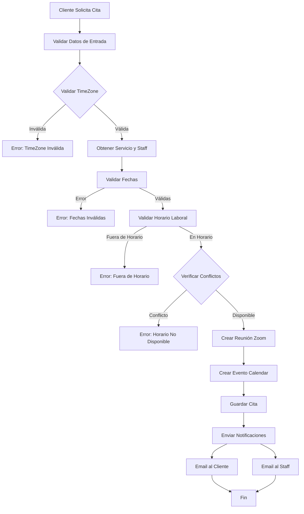
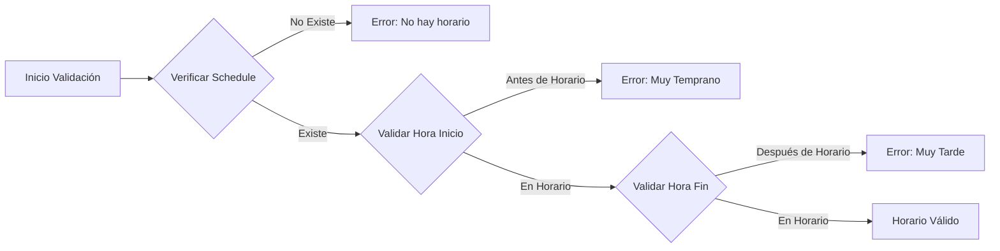
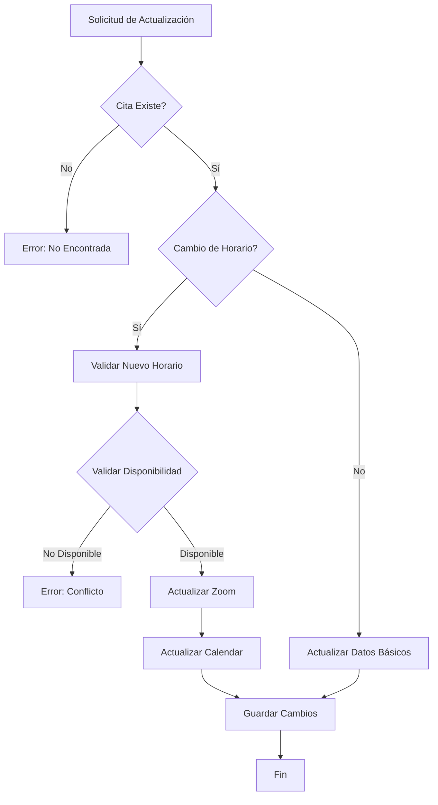
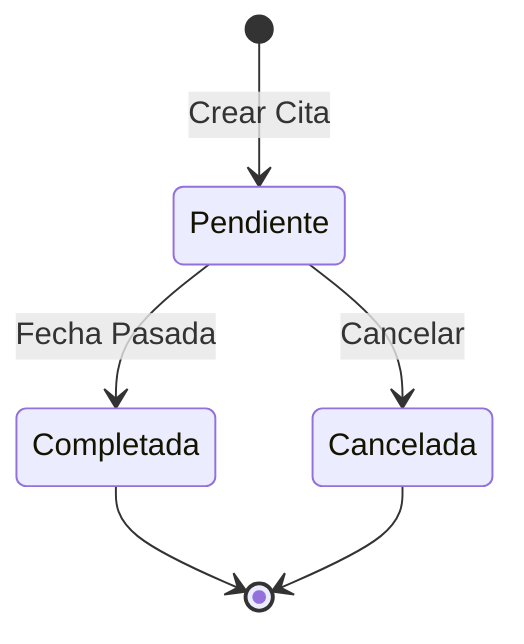
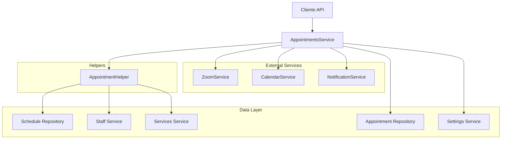

# Diagramas de Flujo del Sistema de Citas

## 1. Flujo de Creación de Citas

## 2. Flujo de Validación de Horarios

## 3. Flujo de Actualización de Citas

## 4. Estados de la Cita y Transiciones

## 5. Componentes del Sistema

